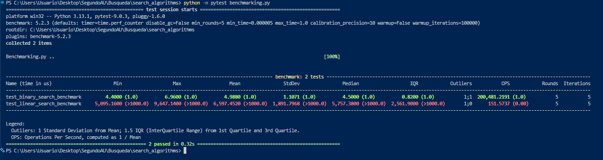

¿Cómo ejectuar el Benchmark?

    Para ejecutar el Benchmark ingresa el siguiente codigo desde la carpeta en la que se clonó el Repositorio:

                                "python -m pytest benchmarking.py"

Anexos:

